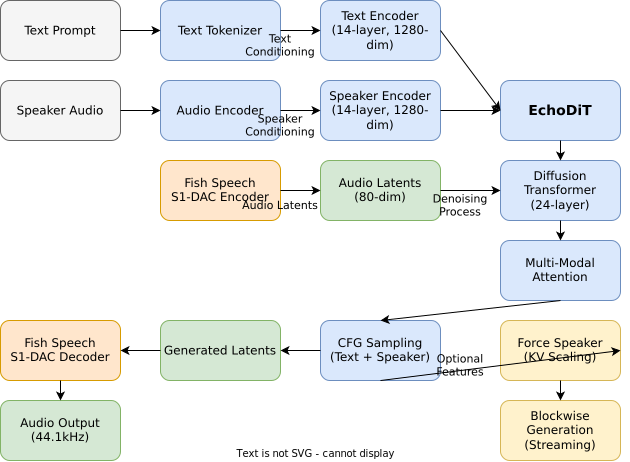

# Echo-TTS

[](https://www.python.org/downloads/)
[](https://pytorch.org/)
[](https://opensource.org/licenses/MIT)
[](https://huggingface.co/jordand/echo-tts-base)

> RunPod serverless worker for Echo-TTS inference

This repository is the **RunPod serverless inference worker** for Echo-TTS. It runs `handler.py` as a queue-based serverless worker, loads models from Hugging Face, and uploads generated audio to S3-compatible storage.

Core model/inference code is vendored from the upstream Echo-TTS repository at image build time (pinned via `Dockerfile`).

**Model:** [jordand/echo-tts-base](https://huggingface.co/jordand/echo-tts-base) | **Live Demo:** [echo-tts-preview](https://huggingface.co/spaces/jordand/echo-tts-preview) | **Blog Post:** [Technical Details](https://jordandarefsky.com/blog/2025/echo/)

## ✨ Features

- **🎯 Multi-Speaker Generation**: Condition on reference audio for voice cloning or use no reference for default voice
- **🔬 Advanced Architecture**: Diffusion Transformer with rotary position embeddings and low-rank AdaLN adaptation
- **⚡ High-Quality Output**: Generates 44.1kHz audio with natural prosody and expression
- **🎛️ Fine Control**: Independent classifier-free guidance for text and speaker conditioning
- **🔄 Long Prompts**: Default text chunking (per-request) for long prompts
- **☁️ Serverless**: RunPod queue-based worker, S3 uploads, persistent voice directory

## 🏗️ Architecture



The Echo-TTS architecture consists of three main modalities processed by a Diffusion Transformer:

1. **Text Encoder**: Processes tokenized text with 14-layer transformer (1280-dim)
2. **Speaker Encoder**: Encodes reference audio into patches using 14-layer transformer
3. **Latent Processor**: Denoises audio latents through 24-layer DiT with multi-modal attention

The model uses Fish Speech S1-DAC autoencoder for audio encoding/decoding and supports classifier-free guidance with independent scales for text and speaker conditioning.

## 🚀 Quick Start

This repo is intended to be built and run as a RunPod serverless worker image. For interactive demos or the upstream Python API examples, use the upstream Echo-TTS repository.

## 📖 Documentation

### Configuration

| Parameter | Description | Default | Range |
|-----------|-------------|---------|-------|
| `cfg_scale_text` | Classifier-free guidance scale for text conditioning | 3.0 | 1.0-10.0 |
| `cfg_scale_speaker` | CFG scale for speaker conditioning | 8.0 | 1.0-15.0 |
| `sequence_length` | Output latent length | 640 | 64-640 |
| `num_steps` | Diffusion sampling steps | 40 | 10-100 |
| `speaker_kv_scale` | Force speaker scaling | None | 1.0-2.0 |

### Low VRAM Configuration (8GB)

For low VRAM tuning in upstream demos, refer to upstream Echo-TTS documentation. This repo does not run the Gradio demo.

### Blockwise Generation

For streaming applications or longer audio, use `inference_blockwise.py`:

```python
from inference_blockwise import sample_blockwise

# Generate in chunks for memory efficiency
audio_chunks = sample_blockwise(
    model=model,
    fish_ae=fish_ae,
    pca_state=pca_state,
    text_prompt="Your long text here...",
    chunk_size=160,  # 7.5 seconds per chunk
    speaker_audio=speaker_audio,
)
```

### Text Prompt Format

Text prompts follow WhisperD format:
- Start with `[S1] ` if not present (automatically added)
- Use commas for pauses
- Colons, semicolons, and em-dashes normalize to commas
- Exclamation points increase expressiveness

Example prompts:
- `[S1] Welcome to our presentation today.`
- `[S1] Hello! How are you doing?`
- `[S1] The weather is beautiful, isn't it?`

## 🧪 Advanced Usage

### Speaker Conditioning

1. **Reference Audio**: 10 seconds typical, up to 5 minutes supported
2. **Force Speaker**: Enable for out-of-distribution text
   - Scale 1.0: baseline (no forcing)
   - Scale 1.5: default when enabled
   - Use lowest scale that produces correct speaker

### Sampling Presets

Use pre-configured presets from `sampler_presets.json`:

```python
import json
with open('sampler_presets.json') as f:
    presets = json.load(f)

# Use a preset
preset = presets['balanced']
sample_fn = partial(sample_euler_cfg_independent_guidances, **preset)
```

## 🔧 Development

### Model Compilation

For improved performance:

```python
from inference import compile_model, compile_fish_ae

model = compile_model(model)
fish_ae = compile_fish_ae(fish_ae)
```

### Running Tests

```bash
# Run inference tests
python -m inference

# Test blockwise generation
python inference_blockwise.py
```

## ☁️ Runpod Serverless (handler-based)

The serverless worker runs `handler.py`. Reference voices come from filenames (no base64) located in a mounted directory, and outputs are written as compressed audio and uploaded to S3-compatible storage (e.g., Backblaze B2).

**Key environment variables**
- `AUDIO_VOICES_DIR` (default `/runpod-volume/echo-tts/audio_voices`; override if you mount elsewhere): directory containing reference audio files (`.wav/.mp3/.m4a/.ogg/.flac/.webm/.aac/.opus`). Pass `speaker_voice: "<filename>"` in requests.
- `OUTPUT_AUDIO_DIR` (default `/runpod-volume/echo-tts/output_audio`; override if you mount elsewhere): temp dir for generated audio before upload.
- `S3_ENDPOINT_URL`: S3-compatible endpoint (e.g., Backblaze B2).
- `S3_ACCESS_KEY_ID`: S3 access key.
- `S3_SECRET_ACCESS_KEY`: S3 secret.
- `S3_BUCKET_NAME`: bucket to store generated audio.
- `S3_REGION` (default `us-east-1`): region name for the client.
- `HF_TOKEN`: Hugging Face token (required because the model weights are gated).

**RunPod cached models (recommended)**
- Configure your endpoint’s **Model (optional)** to `jordand/echo-tts-base` so workers are scheduled onto hosts with the model already cached.
- This worker is configured to use RunPod’s cached-model mount path via `HF_HOME=/runpod-volume/huggingface-cache` and `HF_HUB_CACHE=/runpod-volume/huggingface-cache/hub`.

**Request shape (serverless handler)**
- `text` (str): text to synthesize.
- `speaker_voice` (str, optional): filename in `AUDIO_VOICES_DIR`.
- `parameters` (dict, optional): sampler config (num_steps, cfg_scale_text/speaker, cfg_min_t/cfg_max_t, truncation_factor, rescale_k, rescale_sigma, speaker_kv_scale, speaker_kv_max_layers, speaker_kv_min_t, sequence_length, seed, max_chars_per_chunk).
  - `max_chars_per_chunk` (int, default `300`): long prompts are split and synthesized chunk-by-chunk, then concatenated. Set to `0` to disable chunking.
- `session_id` (str, optional): used for output filename; defaults to UUID.

**Response**
- `status`: `completed` or `error`.
- `filename`: generated audio filename (OGG).
- `url`: presigned URL for download.
- `s3_key`: object key in the bucket.
- `metadata`: sample_rate, duration, seed.

**Deploying to RunPod (critical settings)**
- Build & push an amd64 image: `docker build --platform linux/amd64 -t <registry>/<repo>:echo-tts . && docker push <registry>/<repo>:echo-tts`
- In the RunPod endpoint config:
  - **Container Image**: the pushed tag above
  - **Container Disk**: set to **>= 30 GB** (CUDA base image + deps)
  - **Endpoint Type**: Queue (serverless worker)
  - **Command/Args**: leave blank (uses `CMD ["bash", "/opt/bootstrap.sh"]`)
  - **GPU**: any CUDA 12–compatible GPU (e.g., A10, L4, etc.)
  - **Env vars**: `HF_TOKEN`, `S3_ENDPOINT_URL`, `S3_ACCESS_KEY_ID`, `S3_SECRET_ACCESS_KEY`, `S3_BUCKET_NAME`, `S3_REGION` (default `us-east-1`), `AUDIO_VOICES_DIR` (default `/runpod-volume/echo-tts/audio_voices`), `OUTPUT_AUDIO_DIR` (default `/runpod-volume/echo-tts/output_audio`)

**Client examples (RunPod API)**
- Synchronous run with Bearer token:
```bash
ENDPOINT_ID=<your-endpoint-id>
RUNPOD_API_KEY=<your-runpod-api-key>

curl -X POST "https://api.runpod.ai/v2/${ENDPOINT_ID}/runsync" \
  -H "Content-Type: application/json" \
  -H "Authorization: Bearer ${RUNPOD_API_KEY}" \
  -d '{
    "input": {
      "text": "Hello from Echo-TTS on RunPod.",
      "speaker_voice": "EARS p004 freeform.mp3",
      "parameters": {
        "num_steps": 40,
        "cfg_scale_text": 3.0,
        "cfg_scale_speaker": 8.0,
        "seed": 1234
      }
    }
  }'
# Response (truncated): {"id":"...","status":"COMPLETED","output":{"status":"completed","filename":"...","url":"...","s3_key":"...","metadata":{...}}}
```

- Async run + poll:
```bash
REQUEST_ID=$(curl -s -X POST "https://api.runpod.ai/v2/${ENDPOINT_ID}/run" \
  -H "Content-Type: application/json" \
  -H "Authorization: Bearer ${RUNPOD_API_KEY}" \
  -d '{"input": {"text": "Async test"}}' | jq -r '.id')

curl -X POST "https://api.runpod.ai/v2/${ENDPOINT_ID}/status/${REQUEST_ID}" \
  -H "Authorization: Bearer ${RUNPOD_API_KEY}"
```

- Python snippet:
```python
import os, requests

endpoint_id = os.environ["ENDPOINT_ID"]
api_key = os.environ["RUNPOD_API_KEY"]
url = f"https://api.runpod.ai/v2/{endpoint_id}/runsync"
payload = {"input": {"text": "Python client call", "speaker_voice": None}}

r = requests.post(url, json=payload, headers={"Authorization": f"Bearer {api_key}"})
r.raise_for_status()
print(r.json()["output"]["url"])
```

## ⚠️ Responsible Use

Don't use this model to:
- Impersonate real people without their consent
- Generate deceptive audio (fraud, misinformation, deepfakes)
- Create harmful or inappropriate content

You are responsible for complying with local laws regarding biometric data and voice cloning.

## 📄 License

- **Code**: MIT License (except `autoencoder.py`: Apache-2.0)
- **Model Weights**: CC-BY-NC-SA-4.0
- **Audio Outputs**: CC-BY-NC-SA-4.0 (due to Fish Speech dependency)
- **Audio Prompts**: See `audio_prompts/LICENSE`

## 🙏 Acknowledgments

- [Fish Speech](https://github.com/fishaudio/fish-speech) for the S1-DAC autoencoder
- [TPU Research Cloud](https://sites.research.google/trc/) for compute support
- The Hugging Face community for model hosting

## 📚 Citation

```bibtex
@misc{darefsky2025echo,
    author = {Darefsky, Jordan},
    title = {Echo-TTS: Multi-Speaker Text-to-Speech with Reference Conditioning},
    year = {2025},
    url = {https://jordandarefsky.com/blog/2025/echo/}
}
```
